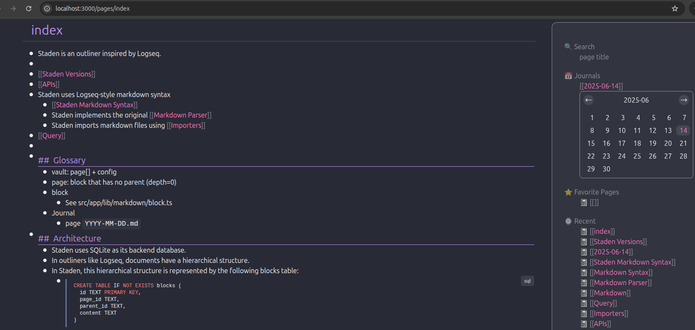

# Staden-outliner: An Opinionated and Maintainable Outliner


- Supports Logseq-like markdown
- Built with a popular stack (TypeScript/Next.js/SQLite)
- Limited features
- Query tables using SQLite

## Roadmap
- Fix remaining FIXMEs
- Add automatic export of markdown files
- Revise the POST `/pages/[title]` endpoint
- Improve the Markdown editor
  - See also https://github.com/oshikiri/react-plaintext-outliner
  - Support pasting images from the clipboard
  - Improve caret movement
  - Implement undo and redo
- Android viewer app
- Full-text search
- Additional E2E tests

## Getting Started

Requirements:
- npm
- Node.js
- SQLite

```bash
# Set root directory
STADEN_ROOT=./docs
```
### Run the development server and view documents

```bash
npm run dev
```

```bash
curl http://localhost:3000/api/initialize
```

After starting the server with these steps, you can view the documents at <http://localhost:3000/pages/index>.



### Run the development server using Docker

For development, you can build and run the `dev` target defined in `docker-compose.yml`.

```bash
docker compose up --build app
```

Once the container is running, open <http://localhost:3000/> in your browser.
When you are done, press `Ctrl+C` in the terminal or run `docker compose down` from a separate shell to stop the stack.

### Run in Production Mode

```bash
npm run build
npm run start
```
