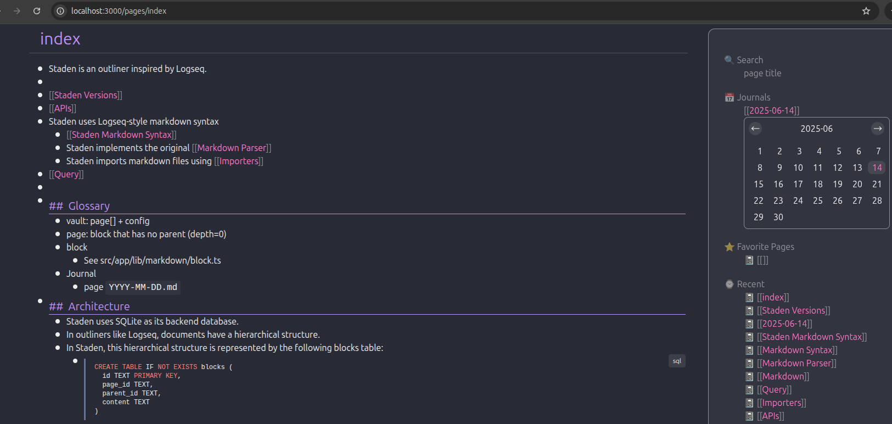

# Staden-outliner: An Opinionated and Maintainable Outliner


- Supports Logseq-like markdown
- Built with TypeScript, Bun, Hono, and SQLite
- Limited features
- Query tables using SQLite

## Roadmap
- Add automatic export of markdown files
- Improve the Markdown editor
  - See also https://github.com/oshikiri/outliner-playground
  - Support pasting images from the clipboard
  - Improve caret movement
  - Implement undo and redo
- Full-text search
- Additional E2E tests

## Getting Started

Requirements:
- Bun
- SQLite

### Run the development server and view documents

Start the Bun dev server with the vault root as the first argument:

```bash
bun run dev -- ./docs
```

The dev server rebuilds the web assets when files under `src/` or `public/` change.

Then initialize the vault:

```bash
curl -X POST http://127.0.0.1:3000/api/initialize
```

After starting the server, you can view the documents at <http://localhost:3000/>.



### Run in Production Mode

```bash
bun run build
```

Start the compiled binary with the vault root as the first argument:

```bash
./dist/staden ./docs
```

Then open <http://localhost:3000/> in your browser.
